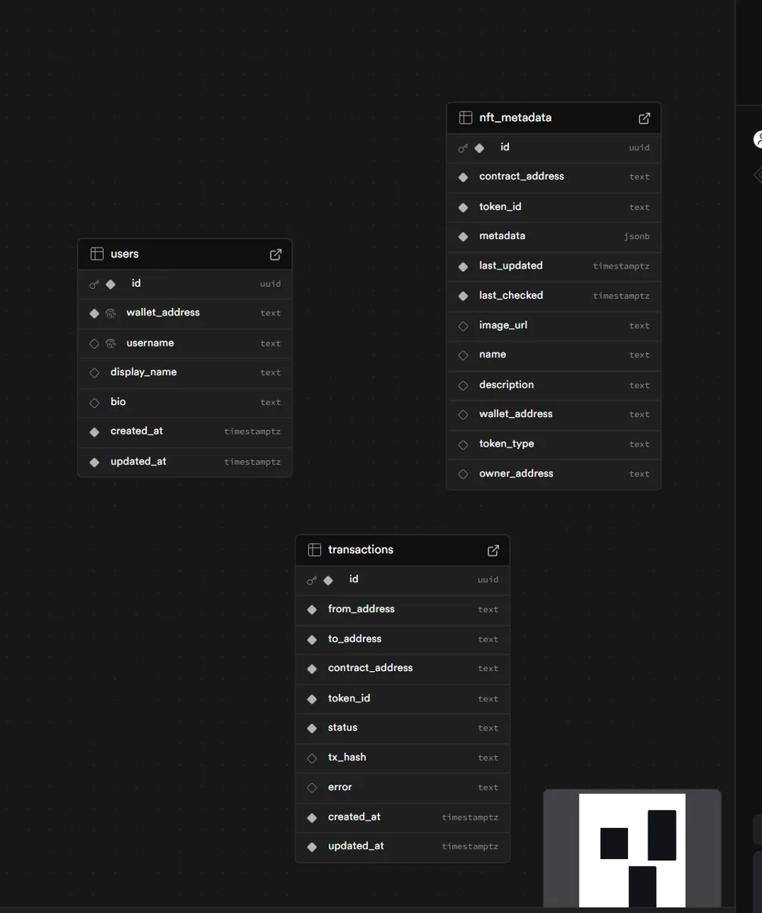

# Backend Architecture

NestJS-based backend providing API endpoints for NFT management and user authentication.

## Directory Structure

```
backend/
├── src/
│   ├── common/         # Shared utilities
│   │   ├── decorators/
│   │   ├── filters/
│   │   ├── guards/
│   │   ├── interceptors/
│   │   └── pipes/
│   ├── core/          # Core modules
│   │   ├── auth/
│   │   ├── cache/
│   │   └── database/
│   ├── features/      # Feature modules
│   │   ├── nft/
│   │   ├── transaction/
│   │   └── user/
│   └── utils/         # Utility functions
```

## Key Design Decisions

### Database Design



Tables:
- users: Stores wallet addresses and usernames
- nft_metadata: Caches NFT metadata
- transactions: Records transfer history

### API Architecture
- RESTful endpoints
- Request validation with class-validator
- Response transformation
- Error handling with filters
- Rate limiting

### NFT Handling
```typescript
@Injectable()
export class NFTMetadataService {
  // 24h cache duration
  private CACHE_DURATION = 24 * 60 * 60 * 1000;
  
  async getMetadata(contractAddress: string, tokenId: string) {
    // Check cache
    // Fetch from chain if needed
    // Store in database
  }
}
```

### Authentication
- JWT-based auth
- Wallet signature verification
- Guard-based route protection

### Performance
- Redis caching
- Response compression
- Request deduplication
- Connection pooling

## API Modules

### NFT Module
- Get user NFTs
- Transfer NFTs
- Metadata caching
- Transaction tracking

### User Module  
- Wallet authentication
- Profile management
- Username registration

### Transaction Module
- Transfer history
- Status updates
- Event tracking

## Configuration

### Server Setup
```typescript
// main.ts
const app = await NestFactory.create(AppModule);
app.use(helmet());
app.use(compression());
app.useGlobalPipes(new ValidationPipe());
```

### Environment Variables
Required variables:
- `POLYGON_RPC_URL`
- `JWT_SECRET`
- `SUPABASE_URL`
- `SUPABASE_KEY`
- `REDIS_URL`